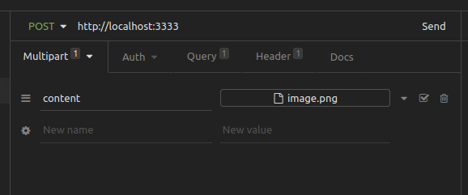

# nsfwjs-docker

A Docker REST API for NSFW detection with [NSFWJS](https://github.com/infinitered/nsfwjs). You can find it on the Docker Hub [here](https://hub.docker.com/r/andresribeiroo/nsfwjs)

## Installation

```shell
docker run -p 3333:3333 -d --name nsfwjs andresribeiroo/nsfwjs
```

## Usage

Make a `POST` request to `localhost:3333` sending the image in the `content` field, like this:



## PS

Maybe I don't know what I'm doing. If anything starts to catch fire, move away

## Author

André Ribeiro, made for my app [Drakkle](https://drakkle.com.br)
